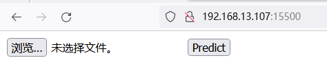
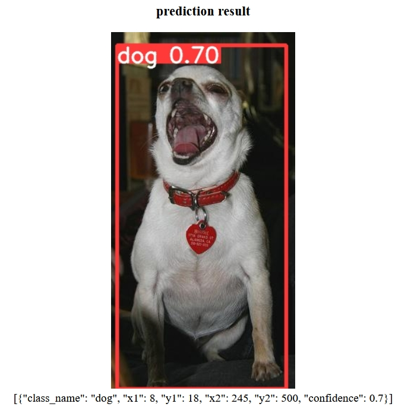

# ymir-flask

基于 chatgpt 产生的代码， 部署ymir模型到云端

# 测试

- 执行以下命令后， 浏览器打开 127.0.0.1:15500 或 <服务器ip>:15500 可以看到 图片上传页面


```
docker pull youdaoyzbx/ymir-executor:flask-api

docker run -it --rm --gpus all --ipc host -p 15500:15500 youdaoyzbx/ymir-executor:flask-api
```

- 上传一张包含狗的图片，点击预测可得如下结果



# 自定义API

## 准备好模型

- 基于镜像 `youdaoyzbx/ymir-executor:ymir2.1.0-yolov5-v7.0-cu111-tmi` 训练好模型，并下载解压到本地，将其最好的模型重命名

```
mv bee8ab5263660fa015cd1a8199c3974cbacc1c62 bee8ab5263660fa015cd1a8199c3974cbacc1c62.tar
tar -xf bee8ab5263660fa015cd1a8199c3974cbacc1c62.tar
mv yolov5_best/best.pt dog.pt
```

## 修改配置

- 在 `server.py` 中配置好 `class_names` 与 `weigths`

```
class_names = ['dog']
cmd = f'python3 detect.py --source {time_stamp}.jpg --weights dog.pt --save-txt --save-conf --exist-ok'
subprocess.run(cmd.split(), check=True)
```

## 制作镜像

```
docker build -t youdaoyzbx/ymir-executor:my-flask-api -f dockerfile .
```

## 启动并应用镜像

```
docker run -it --rm --gpus all --ipc host -p 15500:15500 youdaoyzbx/ymir-executor:my-flask-api
```

浏览器打开127.0.0.1:15500 或 <服务器ip>:15500
